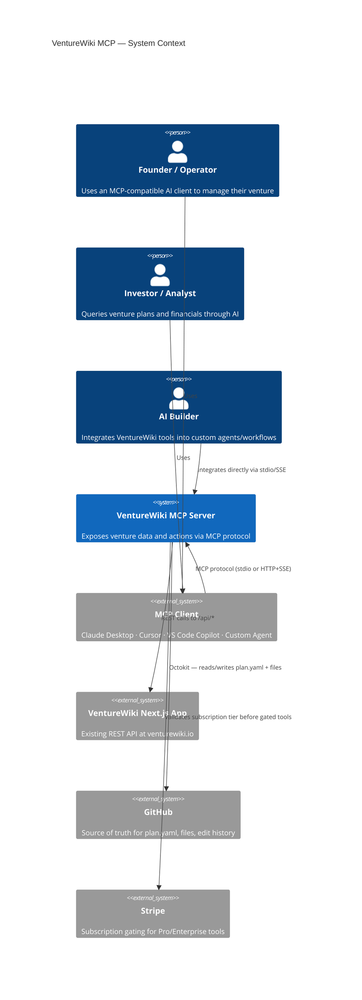
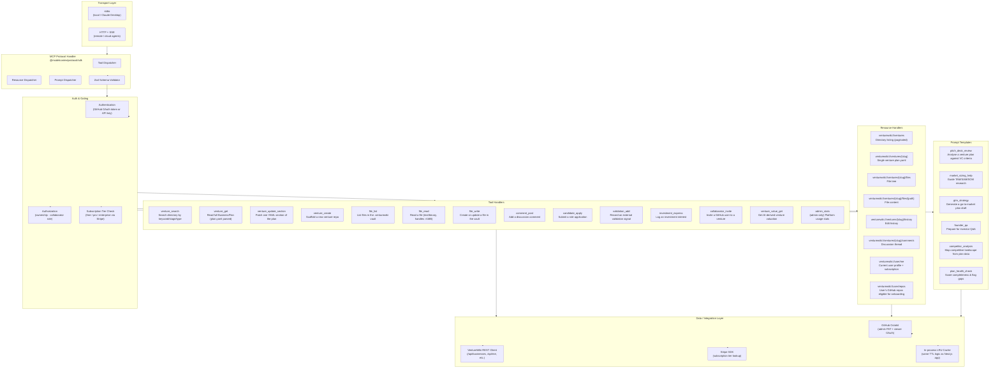
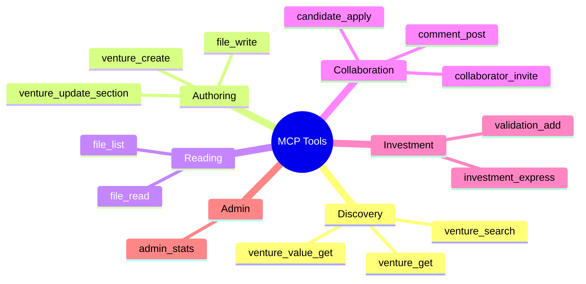
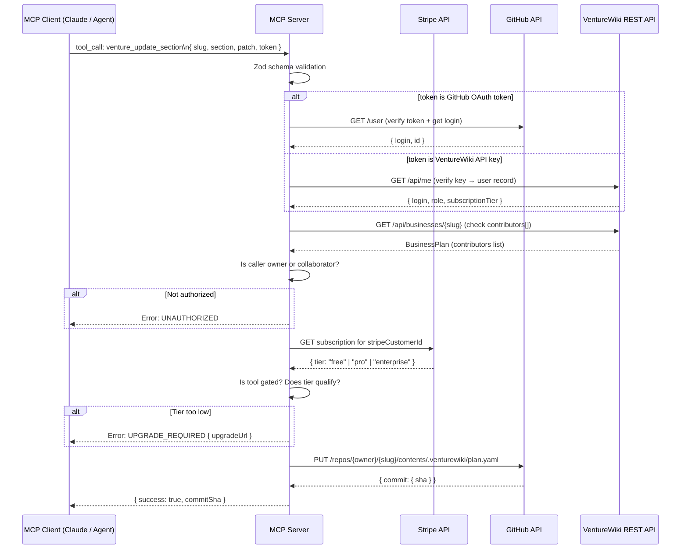
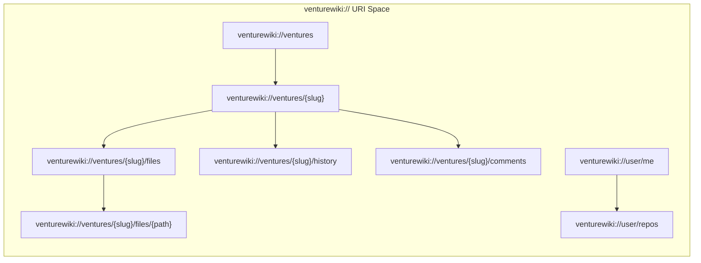
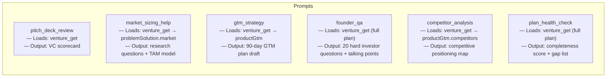
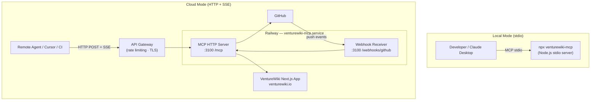

# VentureWiki MCP Server — Architecture Design

## Overview

The VentureWiki MCP (Model Context Protocol) Server exposes VentureWiki's venture intelligence as a set of **tools**, **resources**, and **prompts** that any MCP-compatible AI client (Claude Desktop, Cursor, VS Code Copilot, etc.) can consume. Agents can read and update venture plans, query the file vault, search the directory, and take investment or collaboration actions — all through structured, schema-validated calls backed by the existing GitHub-as-database infrastructure.

---

## 1. System Context



---

## 2. MCP Server Internal Architecture



---

## 3. Tool Catalogue



### Tool Detail

| Tool | Auth Required | Tier | Description |
|---|---|---|---|
| `venture_search` | No | Free | Full-text + filter search across the venture directory |
| `venture_get` | No (public) / Yes (private) | Free | Return the parsed `BusinessPlan` for a slug |
| `venture_create` | Yes | Free | Scaffold a new GitHub repo + `plan.yaml` from template |
| `venture_update_section` | Yes + owner/collab | Free | Patch a single YAML section (cover, problemSolution, etc.) |
| `file_list` | No (public) / Yes (private) | Free | List `.venturewiki/` file tree |
| `file_read` | No (public) / Yes (private) | Free | Read text or binary file; auto-fetches via `download_url` for >1 MB |
| `file_write` | Yes + owner/collab | Pro | Create or update a file in the `.venturewiki/` vault |
| `comment_post` | Yes | Free | Post a discussion comment |
| `candidate_apply` | Yes | Free | Submit application for an open role |
| `validation_add` | Yes | Pro | Record an external validation (customer, press, pilot) |
| `investment_express` | Yes | Free | Log interest in investing with amount + terms |
| `collaborator_invite` | Yes + owner | Pro | Invite GitHub user to a venture GitHub team |
| `venture_value_get` | No (public) | Free | Retrieve AI-derived valuation for a venture |
| `admin_stats` | Yes + admin role | Enterprise | Platform-wide stats (users, ventures, edits) |

---

## 4. Authentication & Authorization Flow



---

## 5. Resource URI Scheme



Resources are **read-only** subscriptions (MCP resource model). Mutations always go through **Tools**. Resources support `list` (paginated) and `read` (single item). The MCP server emits `notifications/resources/updated` when a venture's `plan.yaml` or file list changes (via GitHub webhook → SSE push).

---

## 6. Prompt Templates



Each prompt template:
1. Accepts `slug` as a required argument
2. Calls `venture_get` to embed the live plan data into the system prompt
3. Returns a structured `messages[]` array for the AI client to send to the model
4. Is versioned (e.g. `pitch_deck_review@2`) so callers can pin a version

---

## 7. Deployment Architecture



### Environment Variables

| Variable | Purpose |
|---|---|
| `GITHUB_ADMIN_TOKEN` | Admin PAT for public repo reads + team management |
| `VENTUREWIKI_API_BASE` | Base URL of the Next.js app REST API (`https://venturewiki.io`) |
| `VENTUREWIKI_API_SECRET` | Internal shared secret for server-to-server calls |
| `STRIPE_SECRET_KEY` | Subscription tier lookup |
| `GITHUB_WEBHOOK_SECRET` | Verify incoming push events for resource notifications |
| `MCP_TRANSPORT` | `stdio` (default) or `sse` |
| `PORT` | HTTP port for SSE mode (default `3100`) |

---

## 8. Package Structure

```
venturewiki-mcp/
├── src/
│   ├── index.ts              # Entry: create server, register all handlers, start transport
│   ├── server.ts             # McpServer factory + tool/resource/prompt registration
│   ├── transport/
│   │   ├── stdio.ts          # StdioServerTransport
│   │   └── sse.ts            # SSEServerTransport (Express)
│   ├── tools/
│   │   ├── venture.ts        # venture_search, venture_get, venture_create, venture_update_section
│   │   ├── files.ts          # file_list, file_read, file_write
│   │   ├── social.ts         # comment_post, candidate_apply, investment_express, validation_add
│   │   ├── collaboration.ts  # collaborator_invite
│   │   └── admin.ts          # admin_stats
│   ├── resources/
│   │   ├── ventures.ts       # venturewiki://ventures[/{slug}[/...]]
│   │   └── user.ts           # venturewiki://user/me, venturewiki://user/repos
│   ├── prompts/
│   │   ├── pitch-deck-review.ts
│   │   ├── market-sizing.ts
│   │   ├── gtm-strategy.ts
│   │   ├── founder-qa.ts
│   │   ├── competitor-analysis.ts
│   │   └── plan-health-check.ts
│   ├── auth/
│   │   ├── github.ts         # Verify GitHub OAuth tokens
│   │   ├── apiKey.ts         # Verify VW API keys
│   │   └── tier.ts           # Stripe subscription tier check
│   ├── data/
│   │   ├── github.ts         # Octokit wrappers (mirrors src/lib/github.ts)
│   │   ├── ventures.ts       # Fetch/write plan.yaml (mirrors src/lib/db/businesses.ts)
│   │   ├── files.ts          # Read/write venture files (mirrors src/lib/db/files.ts)
│   │   └── cache.ts          # LRU cache
│   └── webhooks/
│       └── github.ts         # Push event → resource notification
├── package.json              # @modelcontextprotocol/sdk, octokit, zod, stripe, express
└── Dockerfile                # Multi-stage Node build for Railway deployment
```

---

## 9. Key Design Decisions

| Decision | Rationale |
|---|---|
| **GitHub as the database** | Reuses the existing `plan.yaml` + `.venturewiki/` convention; no separate DB required |
| **Mirror auth logic from Next.js app** | Same GitHub OAuth token → same access rules; no new auth surface |
| **Zod for all tool input schemas** | MCP SDK auto-generates `inputSchema` JSON Schema from Zod; single source of truth |
| **`download_url` fallback for large files** | GitHub API returns empty `content` for files >1 MB; same fix already applied in the Next.js app |
| **Subscription tier via Stripe** | Pro/Enterprise tool gating matches the existing billing model without duplicating user storage |
| **Dual transport (stdio + SSE)** | `stdio` for local Claude Desktop use; `SSE` for cloud agents and CI pipelines |
| **Prompt templates embed live plan data** | Agents always work against the current plan state, not a stale snapshot |
| **Separate Railway service** | Keeps the MCP server independently scalable and deployable without touching the Next.js app |
